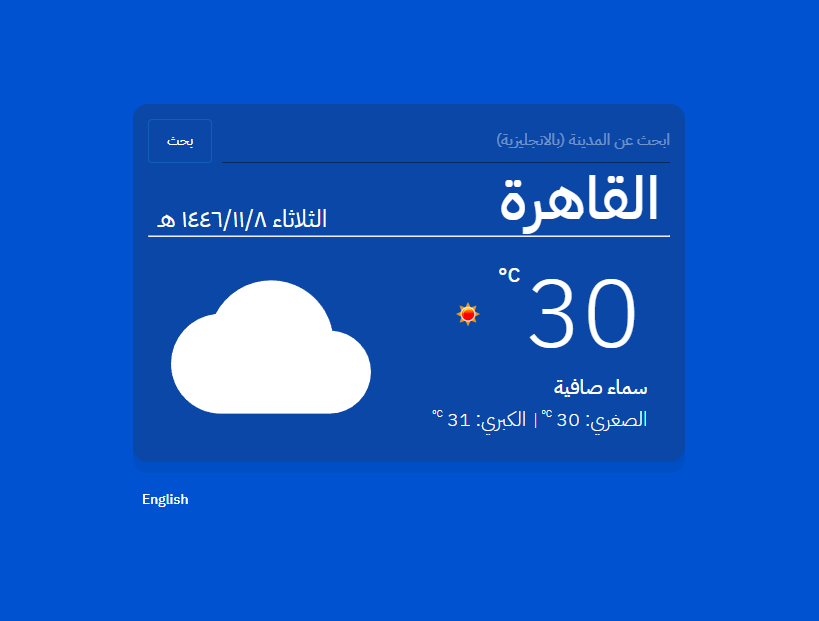

# 🌤️ Weather App

This is a simple weather application built with **React**, **Material-UI (MUI)**, and the **OpenWeatherMap API**. It allows users to search for a city and view real-time weather information with support for **Arabic and English** languages.

---

## 🚀 Features

- 🔍 Search for any city
- 🌡️ Displays current temperature, min/max temperatures
- 🌐 Language toggle (Arabic / English)
- 🧊 Uses Metric units (°C)
- 🎨 Responsive and styled using **Material UI**
- 🔄 Automatically fetches weather data when language or city changes

---

## 🧑‍💻 Tech Stack

- **React**
- **Material-UI**
- **Axios**
- **OpenWeatherMap API**
- **React Spinners (ClipLoader)**

---

## 📸 Preview



## 🚀 Live Demo

[🔗 View Live Demo](https://weather-app155.netlify.app)

---

## 🔧 Setup Instructions

1. **Clone the repository**:
   ```bash
   git clone https://github.com/your-username/weather-app.git
   cd weather-app

2. **Install dependencies**:
   ```bash
   npm install

3. **Run the development server**:
   ```bash
   npm run dev